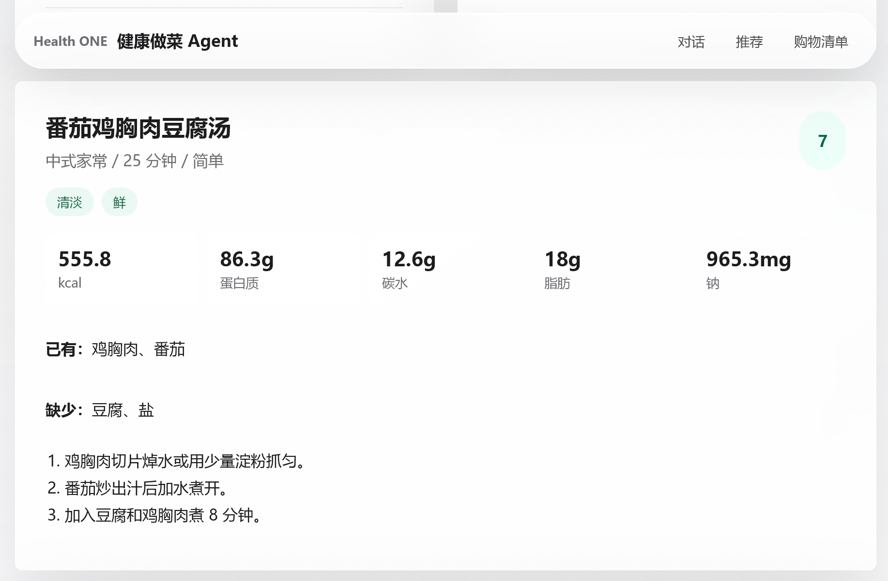

# Health ONE

Health ONE 是一个面向健康饮食和家庭做饭场景的智能健康 Agent 项目。项目目标不是只做“菜谱聊天机器人”，而是打通：

- 手机健康数据同步
- 菜谱知识库与 RAG 检索
- DeepSeek API Agent 推理
- 营养计算工具
- 食材替换与购物清单
- 慢病、忌口、老人饮食提醒
- Android App，后续扩展 iOS App

## 项目优势

| 对比点 | 普通菜谱 RAG / Agent 项目 | Health ONE |
|---|---|---|
| 健康数据 | 通常只依赖用户文字输入 | Android Health Connect 同步步数、活动消耗、训练、睡眠、体重 |
| 推荐逻辑 | 主要依赖 LLM 文本生成 | RAG 检索 + 营养计算工具 + 健康约束 + 购物清单工具 |
| 健身目标 | 多停留在增肌/减脂提示词 | 根据每日训练消耗调整热量、蛋白质和餐食建议 |
| 慢病饮食 | 多数只做简单忌口 | 支持高血压轻盐、糖尿病控糖、肾病谨慎、老人易咀嚼规则 |
| 食材库存 | 多数只处理一次性输入 | 支持冰箱库存、缺少食材、剩余食材推荐和购物清单 |
| 可验证性 | LLM 可能编造营养数据 | 后端按食材克重计算营养，减少纯生成误差 |
| 家庭场景 | 多数面向单人菜谱问答 | 面向中式家常菜、家庭成员忌口和老人共同用餐 |

Health ONE 的核心价值是把“今天实际消耗了多少、家里有什么、谁不能吃什么、多久能做好”放到同一个推荐流程里。

## 项目结构

```text
backend/      FastAPI 后端、Agent tools、RAG 检索、健康数据接口
frontend/     React + Vite 前端，以及无依赖 standalone 前端
androidapp/   Kotlin + Jetpack Compose + Health Connect Android App
pic/          README 展示图片
```

## 后端启动

```powershell
cd backend
python -m venv .venv
.\.venv\Scripts\Activate.ps1
pip install -r requirements.txt
uvicorn main:app --reload --host 127.0.0.1 --port 8000
```

后端地址：

```text
http://127.0.0.1:8000
```

接口文档：

```text
http://127.0.0.1:8000/docs
```

## 前端启动

```powershell
cd frontend
npm install
npm run dev
```

## Android App

使用 Android Studio 打开 `androidapp/` 目录。

Android 第一版包含：

- Jetpack Compose UI
- Health Connect 权限申请
- 当日步数、活动消耗、训练、睡眠、体重读取
- `POST /api/health/connect/sync` 同步到 FastAPI
- `POST /api/chat` 获取饮食推荐

模拟器访问电脑本机 FastAPI 默认使用：

```text
http://10.0.2.2:8000/api
```

真机调试时，把下面文件里的 `baseUrl` 改成电脑局域网 IP：

```text
androidapp/app/src/main/java/com/healthone/app/HealthOneApi.kt
```

## 基于 Google Health Connect

Health ONE 的 MVP 使用 **Google Health Connect** 作为 Android 端健康数据入口，后续可继续扩展 Google 健康生态相关能力。

官方参考：

- [Health Connect](https://developer.android.com/health-and-fitness/health-connect)

数据流程：

```text
Android App
  -> 请求 Health Connect 权限
  -> 读取 Steps / Calories / Exercise / Sleep / Weight
  -> 汇总为每日健康日志
  -> POST /api/health/connect/sync
  -> FastAPI 后端保存每日汇总
  -> Agent 根据训练消耗调整饮食建议
```

后端不会绕过手机权限直接读取用户健康数据。Health Connect 的授权、读取和权限解释都发生在 Android 设备端；后端只接收用户授权后的每日汇总。

## 后续 iOS 规划

iOS 版本计划使用 **Apple HealthKit** 读取步数、活动能量、训练、睡眠和体重，并复用现有 FastAPI、菜谱 RAG、营养计算和 Agent 工具链。iOS 端主要负责授权、读取和同步健康数据，不重复实现后端核心逻辑。

## 后续路线

- 增加拍照识别冰箱食材。
- 增加家庭成员管理和老人饮食提醒。
- 增加季节、地理位置相关的水果与膳食提醒。
- 扩展 iOS HealthKit App。

## 参考项目

感谢以下开源项目，Health ONE 的架构、菜谱管理、营养计算和 Agent 工具调用设计可以从它们中借鉴：

- [Mealie](https://github.com/mealie-recipes/mealie)：自托管菜谱管理、Meal Plan、购物清单、REST API，适合参考产品架构。注意 AGPL-3.0。
- [Tandoor Recipes](https://github.com/TandoorRecipes/recipes)：菜谱管理、餐食计划、购物清单，功能接近基础需求。
- [Grocy](https://github.com/grocy/grocy)：冰箱、家庭库存、保质期、购物管理，适合参考“根据剩余食材推荐”。
- [RecipeSage](https://github.com/julianpoy/RecipeSage)：PWA、菜谱保存、Meal Plan、购物清单、营养追踪。
- [PANTS](https://github.com/dylanleigh/PriceAndNutritionTrackingSystem)：开源营养追踪和菜谱营养分析，适合参考营养计算。
- [mealie-cli](https://github.com/jez500/mealie-cli)：把 Mealie 做成 CLI / MCP 风格工具，适合参考 Agent 工具调用设计。
